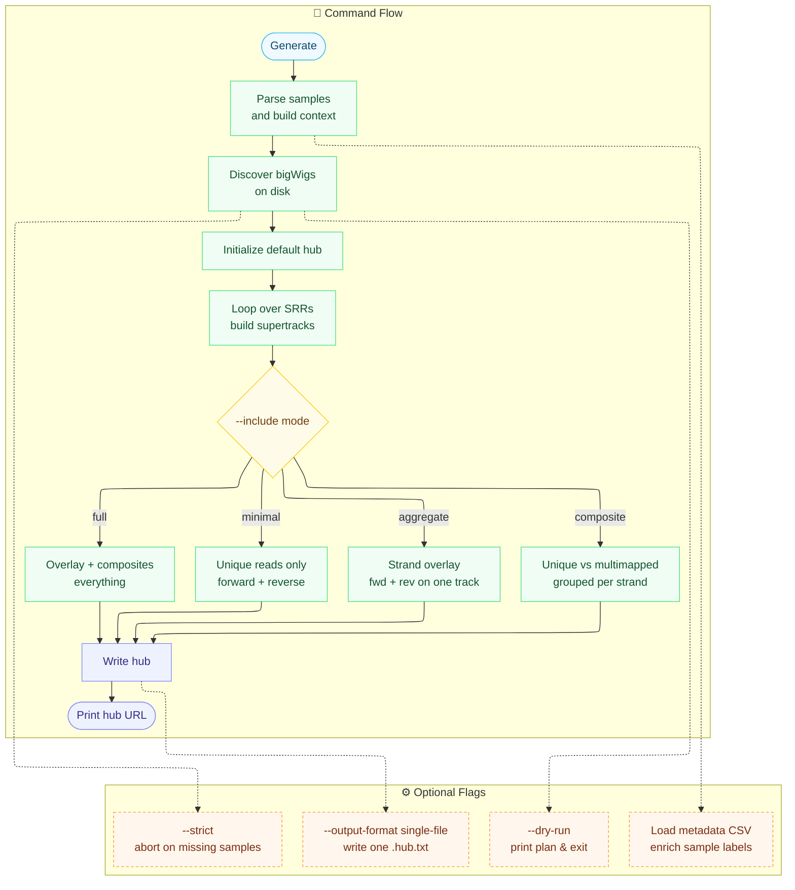

# Internship

Code for my 2026 Internship. Builds GWIPS-viz track hubs from p-shifted RiboSeq bigWigs.

## How it works


## Files

- `hub_builder.py` - the CLI tool
- `sorting.sh` - organizes raw bigWigs into the expected layout

## Use

```bash
pip install trackhub click
python hub_builder.py generate --help
```

## Status

Work in progress.
