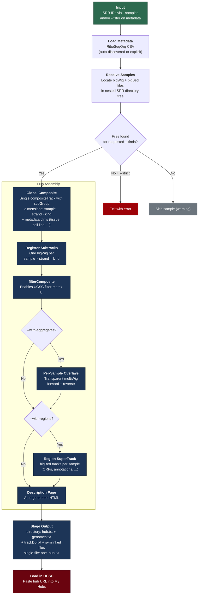

# RiboHub

A command-line tool for building [UCSC Genome Browser](https://genome.ucsc.edu/) track hubs from P-shifted bigWig files produced by a Ribo-seq pipeline. Designed around the [RiboSeqOrg](https://riboseqorg.org/) data ecosystem and the [GWIPS-viz](https://gwips.ucc.ie/) browser infrastructure.

## How It Works


```mermaid
flowchart TD
    A["<b>Input</b><br/>SRR IDs via --samples<br/>and/or --filter on metadata"] --> B["<b>Load Metadata</b><br/>RiboSeqOrg CSV<br/>(auto-discovered or explicit)"]
    B --> C["<b>Resolve Samples</b><br/>Locate bigWig + bigBed files<br/>in nested SRR directory tree"]
    C --> D{"Files found<br/>for requested --kinds?"}
    D -- "No + --strict" --> X["Exit with error"]
    D -- "No" --> S["Skip sample (warning)"]
    D -- "Yes" --> E

    subgraph build ["Hub Assembly"]
        direction TB
        E["<b>Global Composite</b><br/>Single compositeTrack with subGroup<br/>dimensions: sample · strand · kind<br/>+ metadata dims (tissue, cell line, ...)"]
        E --> F["<b>Register Subtracks</b><br/>One bigWig per<br/>sample × strand × kind"]
        F --> G["<b>filterComposite</b><br/>Enables UCSC filter-matrix UI"]
        G --> H{"--with-aggregates?"}
        H -- "Yes" --> I["<b>Per-Sample Overlays</b><br/>Transparent multiWig<br/>forward + reverse"]
        H -- "No" --> J
        I --> J{"--with-regions?"}
        J -- "Yes" --> K["<b>Region SuperTrack</b><br/>bigBed tracks per sample<br/>(ORFs, annotations, ...)"]
        J -- "No" --> L
        K --> L["<b>Description Page</b><br/>Auto-generated HTML"]
    end

    L --> M["<b>Stage Output</b><br/>directory: hub.txt + genomes.txt<br/>+ trackDb.txt + symlinked files<br/>single-file: one .hub.txt"]
    M --> N["<b>Load in UCSC</b><br/>Paste hub URL into My Hubs"]

    style A fill:#2d6a4f,stroke:#1b4332,color:#fff
    style E fill:#1d3557,stroke:#0d1b2a,color:#fff
    style F fill:#1d3557,stroke:#0d1b2a,color:#fff
    style G fill:#1d3557,stroke:#0d1b2a,color:#fff
    style I fill:#1d3557,stroke:#0d1b2a,color:#fff
    style K fill:#1d3557,stroke:#0d1b2a,color:#fff
    style L fill:#1d3557,stroke:#0d1b2a,color:#fff
    style M fill:#1d3557,stroke:#0d1b2a,color:#fff
    style N fill:#6a040f,stroke:#370617,color:#fff
    style X fill:#9d0208,stroke:#370617,color:#fff
    style S fill:#6c757d,stroke:#343a40,color:#fff
```

## Architecture

RiboHub produces a **single global composite track** rather than one track container per sample. All bigWig subtracks live inside one `compositeTrack` and are tagged with `subGroup` dimensions:

| Dimension | Source | Purpose |
|---|---|---|
| **sample** | SRR IDs | Filter by experiment |
| **strand** | `forward`, `reverse` | Filter by strand |
| **kind** | `all`, `unique`, `multi` | Filter by read mapping type |
| **tissue** | Metadata CSV | Filter by tissue |
| **cell_line** | Metadata CSV | Filter by cell line |
| **condition** | Metadata CSV | Filter by experimental condition |
| **inhibitor** | Metadata CSV | Filter by translation inhibitor |

UCSC's `filterComposite` directive exposes these as a clickable filter matrix in the track settings UI, so users can toggle any combination on or off. Dimensions with only one distinct value are automatically dropped since they can't filter anything.

In addition to the main composite, RiboHub can build two sibling track groups:

**Aggregate overlays** (`--with-aggregates`, on by default) create one `multiWig` overlay per sample that transparently stacks the forward and reverse strand signals using the bare (all-reads) bigWig files.

**Region tracks** (`--with-regions`, on by default) collect per-sample bigBed files into a `SuperTrack`. Region labels are derived from filenames (e.g. `SRR123_orfs.bb` becomes a track labelled "orfs").

## Requirements

- Python >= 3.10
- [`trackhub`](https://github.com/daler/trackhub)
- [`click`](https://click.palletsprojects.com/)

```bash
pip install trackhub click
```

## Installation

```bash
git clone https://github.com/thibautackaert-commits/Internship.git
cd Internship
pip install -e .
```

Or run directly:

```bash
python ribohub.py --help
```

## Expected File Layout

RiboHub expects bigWig and bigBed files pre-sorted into the following directory structure (matching the output of `sorting.sh`):

```
{data_dir}/
├── metadata.csv                          # auto-discovered if present
└── {SRR[:6]}/
    └── {SRR[6:8]}/
        ├── {SRR}_pshifted_forward.bigWig          # all reads, forward
        ├── {SRR}_pshifted_reverse.bigWig          # all reads, reverse
        ├── {SRR}_pshifted_unique_forward.bigWig
        ├── {SRR}_pshifted_unique_reverse.bigWig
        ├── {SRR}_pshifted_multimapped_forward.bigWig
        ├── {SRR}_pshifted_multimapped_reverse.bigWig
        └── {SRR}_orfs.bb                          # optional bigBed regions
```

For example, `SRR1234567` resolves to `data/SRR123/45/SRR1234567_pshifted_*.bigWig`. Both `.bigWig`/`.bw` and `.bigBed`/`.bb` extensions are recognized. Files not matching the expected naming scheme are skipped with a debug warning.

## Usage

```bash
python ribohub.py [--verbose] generate [OPTIONS]
```

### Options

| Option | Required | Default | Description |
|---|---|---|---|
| `--samples` | * | — | Sample selection: single ID, comma list, `.txt` file, or `.csv` (first column). Optional when `--filter` is given. |
| `--data-dir` | yes | `$RIBOHUB_DATA_DIR` | Root directory of sorted bigWig files |
| `--output-dir` | yes | `$RIBOHUB_OUTPUT_DIR` | Directory where the hub will be written |
| `--base-url` | yes | `$RIBOHUB_BASE_URL` | Public URL serving `output-dir` |
| `--metadata` | no | auto | RiboSeqOrg-style metadata CSV. Auto-discovered from `--data-dir` if named `metadata.csv` or `RiboSeqOrg_Metadata.csv`. |
| `--filter` | no | — | Filter samples from metadata. Format: `COL=VAL` or `COL=VAL1\|VAL2`, comma-separated for AND. Requires metadata. |
| `--genome` | no | `hg38` | UCSC genome assembly |
| `--hub-name` | no | `RiboSeqHub` | Hub directory name (no spaces) |
| `--email` | no | `your@email.com` | Contact email written into `hub.txt` |
| `--output-format` | no | `directory` | `directory` (multi-file) or `single-file` (useOneFile hub) |
| `--kinds` | no | `all,unique,multi` | Which read types to include in the composite |
| `--with-aggregates` | no | on | Include per-sample strand-overlay aggregates |
| `--with-regions` | no | on | Include bigBed region tracks |
| `--auto-scale` | no | on | Let UCSC auto-scale the y-axis. When off, uses fixed viewLimits. |
| `--strict` | no | off | Exit with error if any sample is missing or partial |
| `--dry-run` | no | off | Report what would be built without writing files |
| `--color-fwd` | no | `#E69F00` | Forward strand color (orange) |
| `--color-rev` | no | `#0072B2` | Reverse strand color (blue) |
| `--color-fwd-multi` | no | `#F0C566` | Forward multimapped color |
| `--color-rev-multi` | no | `#56B4E9` | Reverse multimapped color |

\* At least one of `--samples` or `--filter` must be provided. When both are given, the sample set is their intersection.

### Sample Selection

`--samples` accepts four formats:

| Format | Example |
|---|---|
| Single SRR ID | `--samples SRR1234567` |
| Comma-separated list | `--samples SRR1234567,SRR7654321` |
| Plain text file (one ID per line) | `--samples samples.txt` |
| CSV file (first column used) | `--samples metadata.csv` |

### Metadata Filtering

When a metadata CSV is available, `--filter` lets you select samples by column values without listing SRR IDs manually:

```bash
# All HEK293 samples under high-dose conditions
python ribohub.py generate \
  --filter "CONDITION=High,CELL_LINE=HEK293" \
  --data-dir /data/riboseq \
  --output-dir /var/www/hubs \
  --base-url https://myserver.example.com/hubs

# OR logic within a field, AND across fields
python ribohub.py generate \
  --filter "CONDITION=High|Test,INHIBITOR=CHX" \
  --data-dir /data/riboseq \
  --output-dir /var/www/hubs \
  --base-url https://myserver.example.com/hubs
```

Suggested filter columns: `CONDITION`, `INHIBITOR`, `TISSUE`, `CELL_LINE`, `ScientificName`, `LIBRARYTYPE`, `REPLICATE`.

### Colors

All color options accept standard hex format (`#RRGGBB`). Colors are automatically converted to the `R,G,B` format required by UCSC.

## Examples

Default hub for two samples (all kinds, aggregates and regions on):

```bash
python ribohub.py generate \
  --samples SRR9295900,SRR9295905 \
  --data-dir /data/riboseq \
  --output-dir /var/www/hubs \
  --base-url https://gwips.ucc.ie/hubs
```

Unique-only composite, no aggregates, dry run:

```bash
python ribohub.py generate \
  --samples samples.txt \
  --data-dir /data/riboseq \
  --output-dir /var/www/hubs \
  --base-url https://gwips.ucc.ie/hubs \
  --kinds unique \
  --no-aggregates \
  --dry-run
```

Single-file hub from metadata filter:

```bash
python ribohub.py generate \
  --filter "TISSUE=Brain,INHIBITOR=CHX" \
  --data-dir /data/riboseq \
  --output-dir /var/www/hubs \
  --base-url https://gwips.ucc.ie/hubs \
  --output-format single-file \
  --genome mm10
```

## Output

### Directory format (default)

```
{output-dir}/{hub-name}/
├── {hub-name}.hub.txt
├── genomes.txt
└── hg38/
    ├── trackDb.txt
    └── ... (symlinks to bigWig/bigBed files)
```

### Single-file format

```
{output-dir}/{hub-name}.hub.txt
```

A single `useOneFile` hub containing everything inline.

Load into UCSC by pasting the hub URL into **My Hubs**:

```
https://myserver.example.com/hubs/RiboSeqHub/RiboSeqHub.hub.txt
```

## Troubleshooting

**"No samples found. Nothing to build."**
The directory structure doesn't match what RiboHub expects. Run with `--verbose` to see which paths were checked.

**"--kinds requested [...] but no matching files found"**
The sample directories exist but don't contain files for the requested kinds. Try `--kinds all` or check that your pipeline produced the expected bigWig variants.

**"--filter matched N sample(s) in metadata but 0 have bigWig files"**
The filter worked against the CSV but none of those SRR IDs have files in `--data-dir`. Check that the data directory matches the metadata.

**Hub loads in UCSC but shows no tracks**
Verify that `--base-url` is publicly reachable by UCSC's servers (not `localhost` or an internal IP). The bigWig files must be accessible at `{base-url}/{relative-path}`.

**Hex color error**
Colors must be exactly 6 hex digits with an optional `#` prefix, e.g. `#FF0000` or `FF0000`.
